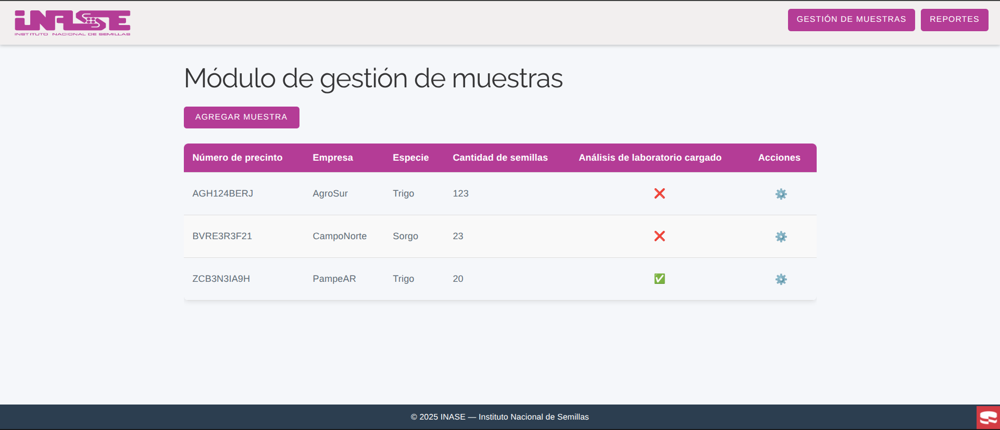
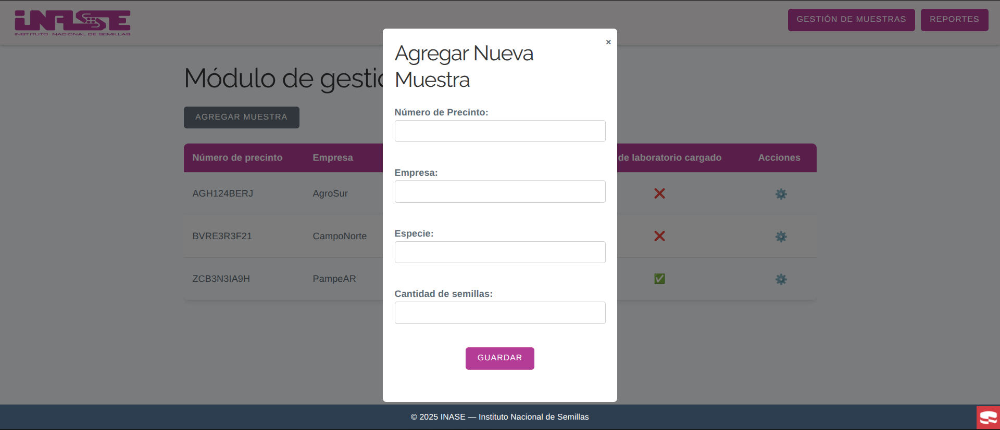
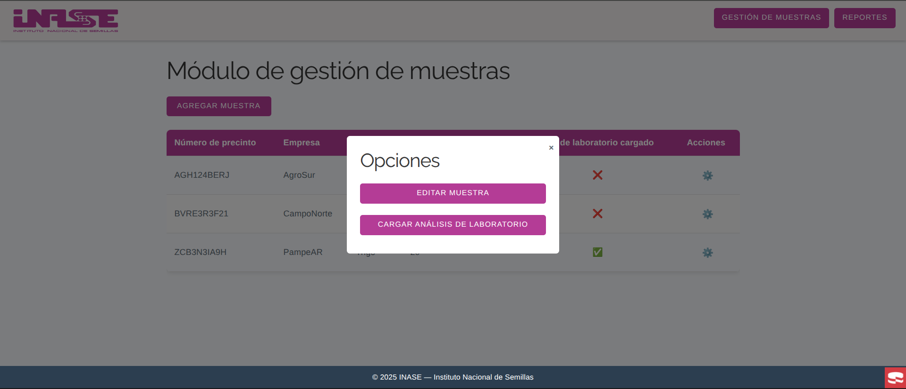
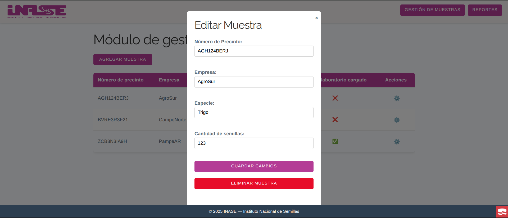
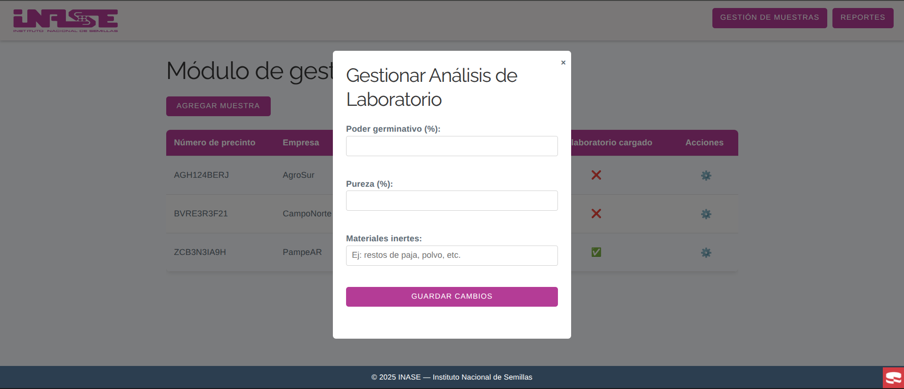
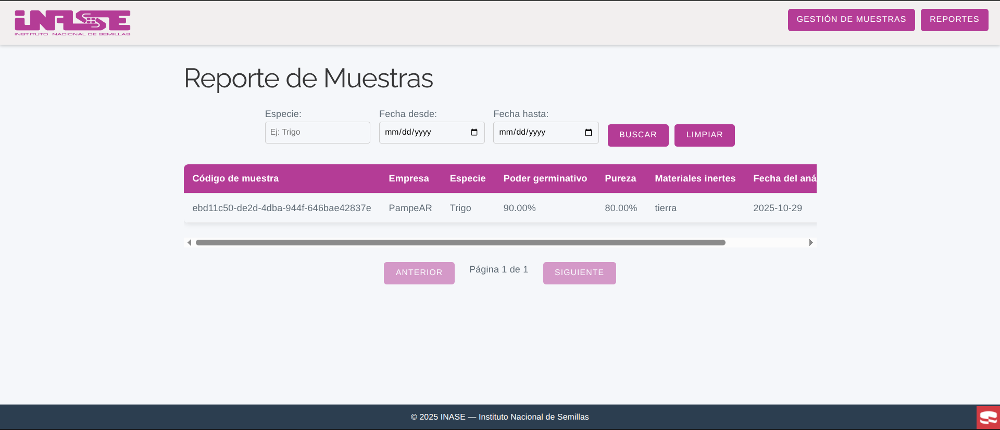

# Desafío técnico - Desarrollador de Software en INASE

El presente proyecto es un desafío técnico desarrollado en el contexto de un proceso de selección como desarrollador de 
software en el Instituto Nacional de Semillas (INASE). El mismo consiste en la creación de una aplicación web hecha con 
PHP que simula un sistema de gestión de los laboratorios del INASE.

# Índice

- [Instrucciones de ejecución](#instrucciones-de-ejecución)
- [Estructura de la página web](#estructura-de-la-página-web)

## Instrucciones de ejecución

Para ejecutar la aplicación es necesario clonar el repositorio y contar con Docker engine o Docker Desktop instalados.
A continuación se detallan los pasos para la ejecución:

1. Levantar los contenedores con Docker Compose:

   ```bash
   docker-compose up --build
   ```
    
2. Para acceder a la aplicación, abrir un navegador web y dirigirse a la siguiente URL:

   ```
   http://localhost:8080/samples
   ``` 

3. Para detener los contenedores basta con presionar `CTRL + C` en la terminal donde fue levantado el contenedor.

4. En caso de querer limpiar los contenedores para volver a un estado inicial y volver a levantar la aplicación, ejecutar el siguiente comando:

   ```bash
   docker-compose down 
   ```

Luego de esto, solo hay que repetir el paso 1.


5. Adicionalmente, se agregó a phpMyAdmin como parte de la solución a modo de facilitar la visualización del comportarmiento 
óptimo y esperado de la base de datos. Para acceder a phpMyAdmin, solo hay que abrir el navegador y acceder al siguiente
enlace:

   ```
   http://localhost:8081
   ```

## Estructura de la página web

1. **Pantalla de inicio:** Módulo de gestión de muestras. Acá se pueden agregar muestras de semillas, editarlas y agregarles
resultados de análisis de laboratorio.

    

2. **Modal para agregar muestras:** Al tocar el botón "Agregar muestra" se abre un modal para la carga de los datos de una m
muestra.

    

3. **Acciones realizables sobre una muestra:** Al tocar el engranaje que está en la columna de acciones de cada muestra
se abre un modal con las acciones que se pueden realizar sobre la muestra. Una muestra puede ser editada y también se
le puede cargar o editar su análisis de laboratorio.

    

4. **Modal de edición:** Las muestras cargadas pueden ser editadas o eliminadas.

    

5. **Carga del análisis de laboratorio:** Modal que permite cargarle a una muestra su análisis de laboratorio. En
caso de que ya haya un análisis preexistente el modal permitirá editar dicho análisis.

    

6. **Sección de reportes:** Esta sección muestra los reportes completos sobre las muestras de semillas cargadas al sistema
que cuentan con un análisis de laboratorio realizado. La sección cuenta con filtros para facilitar la búsqueda de
reportes y con paginación para no saturar la pantalla del lector.

    